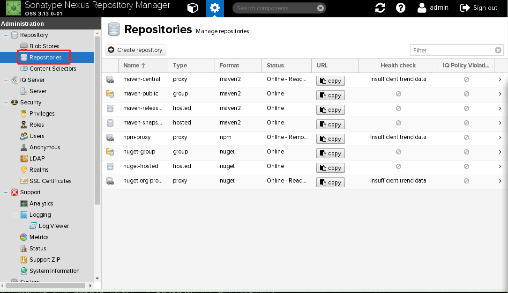

### Nexus Reporestore 配置

### 添加npm 仓库

 实现npm本地网络仓库可以通过npm proxy 进行配置. 步骤如下：

   - 登陆->admin config 如图：
   
   
   - 进入仓库管理界面：
   
   
   - 添加仓库->npm(proxy) 如图：
    

    名称： npm-proxy
    Location of the remote repository being proxied: https://registry.npmjs.org/
    
    点击`Create repository` 确认添加

  
  需要实现公司私有仓库和公共仓库聚合，可以添加一个npm(group)仓库， 这里添加npm-public仓库
  
   - 添加仓库->npm(group) 如图：
    

**测试**
  进入nodejs项目：
  npm --registry=http://172.25.52.217:8081/repository/npm-public/ install

### 添加maven 仓库配置
   
   默认情况下有maven-public仓库有代理功能，代理是maven中心仓库，需要添加一个aliyun maven仓库提高首次下载速度。 步骤如下：
   
   - 添加aliyun-maven-proxy
     添加仓库->maven2(proxy) 如图：
     
   
   名称： aliyun-maven-proxy
   Remote storage: https://maven.aliyun.com/repository/public
   
   - 把maven-proxy 加入到maven-public组
     配置maven-public组， menber里面添加aliyun-maven-proxy
     


### 添加centos yum仓库
   
   添加yum centos aliyun代理仓库， centos yum有几大源，centos和epel源，以centos源为例
   - 添加仓库->yum(proxy) 如图：
    
    
    centos源：
    名称： yum-centos-proxy
    url: https://mirrors.aliyun.com/centos/
    
    epel源：
    名称： yum-epel-proxy
    url: https://mirrors.aliyun.com/epel/
    
    ceph源： yum-ceph-luminous
    url: https://mirrors.aliyun.com/ceph/rpm-luminous/


配置对应nexus.repo:
```
[nexus-centos]
name=Nexus Repository
baseurl=http://IP:8081/repository/yum-centos-proxy/$releasever/os/$basearch/
enabled=1
gpgcheck=0

[nexus-epel]
name=Nexus Repository
baseurl=http://IP:8081/repository/yum-epel-proxy/$releasever/$basearch/
enabled=1
gpgcheck=0

[nexus-ceph-luminous]
name=Nexus Repository
baseurl=http://IP:8081/repository/yum-ceph-luminous/el7/$basearch/
enabled=1
gpgcheck=0
```
