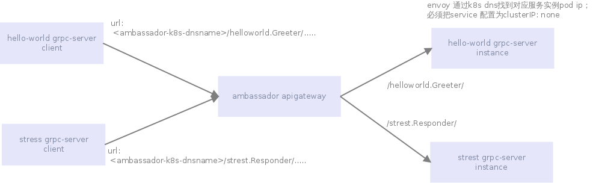

#### 引入ambassador原因

1. 作为grpc服务api网关: 所有内部grpc请求都使用ambassador envoy统一转发, 不用每个服务都配置域名/通过consul服务发现
2. 统一对grpc服务进行负载均衡: grpc是长连接，必须依赖l7负载均衡(k8s service是l4), 否则在客户端维护服务实例连接
3. 简化对envoy配置： ambassador通过模版配置envoy。
4. 通过envoy方便实现canary(灰度)发布

ambassador 适用场景

- 作为内部grpc通信api网关和负载均衡器
- grpc服务灰度发布工具

#### ambassador概述

ambassador项目目的实现k8s下微服务api网关，后台是通过envoy实现api网关。可以通过k8s api控制envoy配置。

我们使用 ambassador做为后面grpc服务api网关。API网关可以在grcp client毫无感知情况下进行转发指定的后端/后端服务负载居衡，只需要修改请求地址和端口，不要程序里面配置每个需要调用grpc服务域名，简化配置。

ambassador 以envoy为后台，通过api方式对envoy进行动态配置。ambassador使用envoy api网关模式。 网关模式和反向代理在技术上可以理解为:

- 反向向代理： envoy里面配置多个vhost(域名)， 不同vhost有不同upstream。
- api网关： envoy里面只用一个default vhost, 不同的path对应不同upstream。

#### grpc服务使用api网关服务好处

- 减少grpc服务服务地址配置: 应用微服务化以后，依赖很多其它服务调用，也期望统一网关处理/管理所有微服务请求。
- 基于grpc服务名称前缀转发: grpc 每个为服务都有一个服务名称，在`.proto`文件里面定义
- 负载均衡: grpc服务实现负载均衡能够全局底层架构上实现，不用在每个应用里面实现
- 结合k8s服务健康检查机制: 当服务检查不通过的时候，k8s自动把实例踢出负载均衡列表，比consul tls机制更加及时。
- 灰度发布： 负载均衡器级别灰度(k8s只能实现实例级别)


#### ambassador实现原理

ambassador实于URL前缀实现api网关代理转发的， 对于gRPC，URL前缀是完整的服务名称。

`https://github.com/grpc/grpc-go/blob/master/examples/helloworld/greeter_server/`例子为例：
```
...
package helloworld;

// The greeting service definition.
service Greeter {
  // Sends a greeting
  rpc SayHello (HelloRequest) returns (HelloReply) {}
}

// The request message containing the user name.
message HelloRequest {
  string name = 1;
}

// The response message containing the greetings
message HelloReply {
  string message = 1;
}
```
所以URL prefix是helloworld.Greeter


例如有两个grpc服务分别是:

grpc-server: 前缀是helloworld.Greeter 代码参考 https://github.com/grpc/grpc-go/blob/master/examples/helloworld/

strest-server（压力测试工具）: 前缀是: strest.Responder 代码参考： https://github.com/BuoyantIO/strest-grpc 


原理图如下:


