kongga 添加微服务
=====

## 描述

1. 添加一个bi-goods微服务域名为： dev.planogram.kong.test.local
2. 微服务上游服务器为172.26.2.46:51000， 名称为: dev-planogram
3. 配置Active health checks： http path: /doc/index.html, 


## 配置步骤

### 创建上游服务器(UPSTREAM)

首先添加bi-goods服务上游服务器, 对应nignx这个配置就是`upstream`， 点击左边菜单`UPSTREAMS`, 进入`UPSTREAMS`配置页面如图：
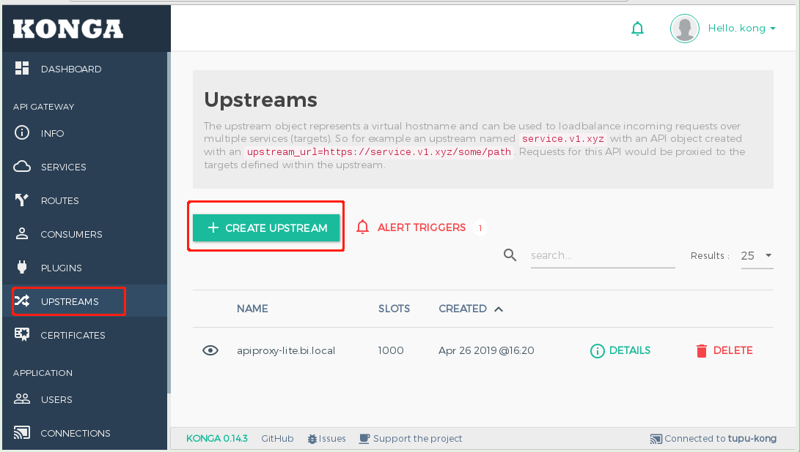

上图点击`CREATE UPSTREAM`进入创建界面如图

**基本配置**
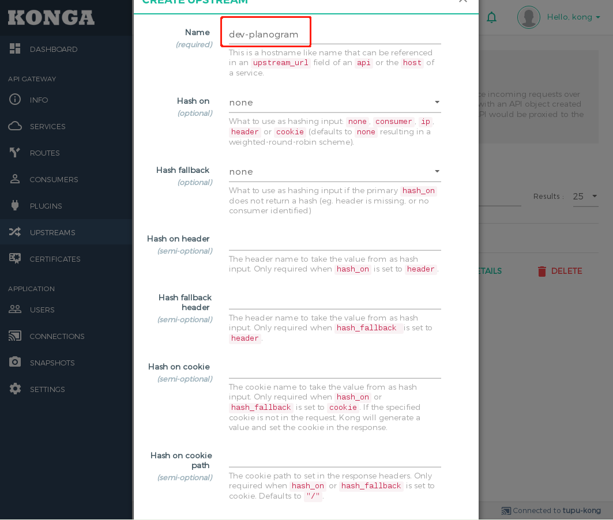
1) Name: dev-planogram
***注意：***
如果部署在k8s里面实例可以配置内网域名： test.<service-name>.tupu.local.

2) Hash on: none (使用weighted-round-robin负载均衡算法)
3) 其它使用默认

**Active health checks**
主动健康检查， kong就会定时向实例发送请求，检查实例是否正常.
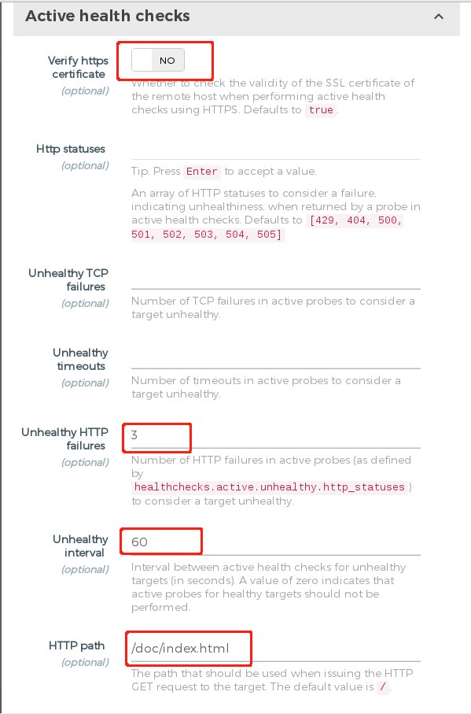

1) Verify https certificate: No (内网实例没有使用https)
2）Unhealthy HTTP failures: 3 (连续失败3次认为不健康， 可以根据实际情况配置)
3）Unhealthy interval: 60 （侦测为不健康以后，多少秒重新发送健康检查）
4）Http path: /doc/index.html (健康检查http路径， 这里没有健康检查path， 使用swagger页面)

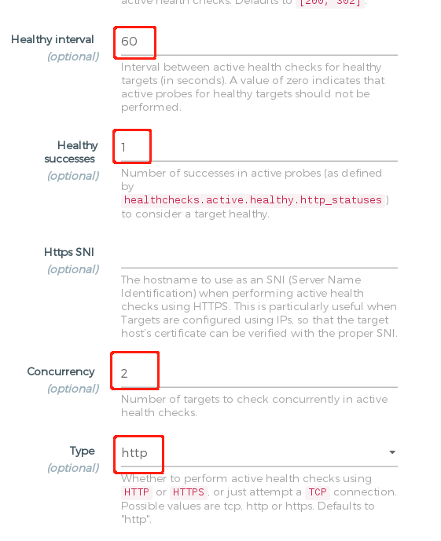
5) Healthy interval: 60 (健康检查间隔时间)
6）Healthy successes: 1 (1次成功以后任务这个实例健康的)
7）Concurrency: 2 （并发数目）
8）Type： http （健康检查类型）


**Passive health checks**

kong向服务实例转发请求失败以后，标记target为不健康
点击"SUBMIT UPSTREAM"

#### 配置UPSTEAM TARGET

点击 item dev-plangogram "DETAILS" 如图：
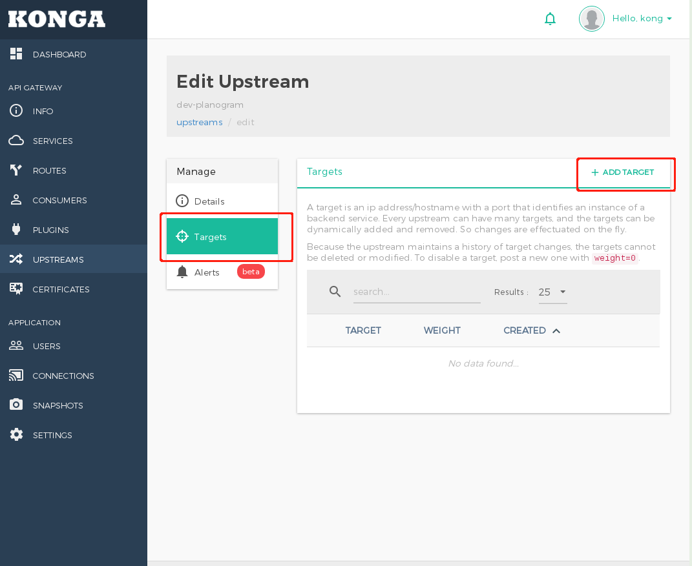

点击"ADD TAGRET" 如图
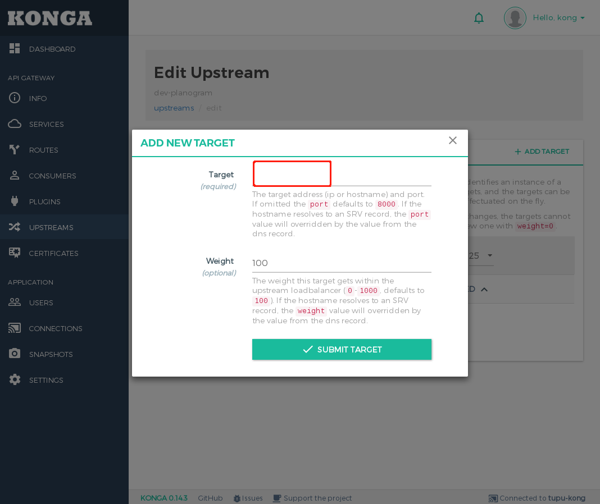

Target: 172.26.2.46:51000


### 创建服务(SERVICE)

点击左边菜单`SERVICES`, 进入`SERVICES`配置页面， 点击`ADD NEW SERVICE`如图：
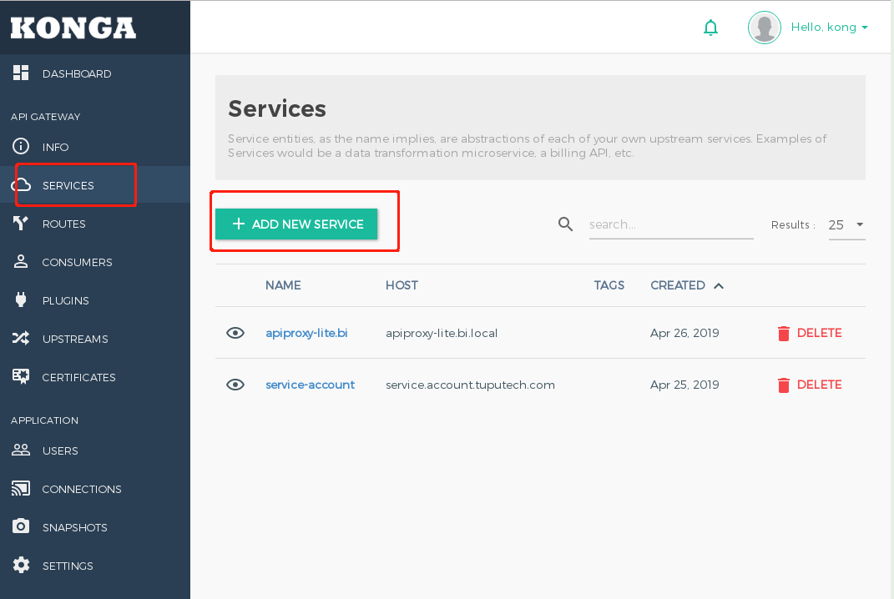

**填写SERVICE基本信息**

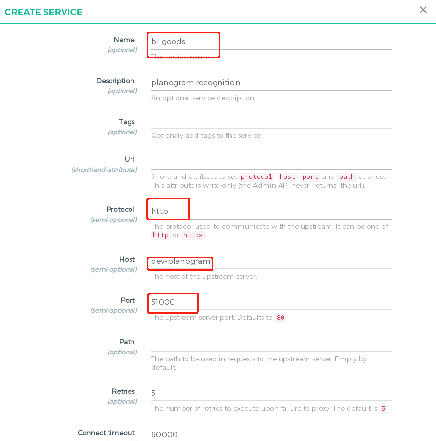

1）Name: bi-goods (服务名称，集群唯一)
2）Protocol: http （和实例请求协议）
3） Host: dev-planogram （实例对应upstream名称，刚刚关键upstream名称）

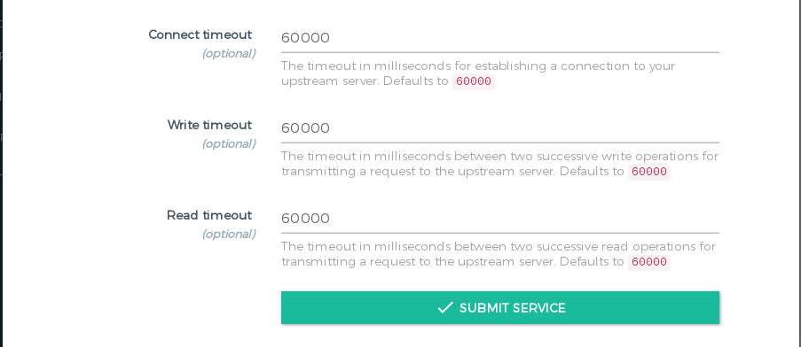

4)Connect timeout 60000 (ms) (实例连接超时时间)
5)Write timeout 60000(ms) (两次写请求超时时间)
6)Rread timeout 60000 (ms) (两次读请求超时时间)


#### 创建服务路由

点击`bi-goods`进入bi-goods service details, 如图：
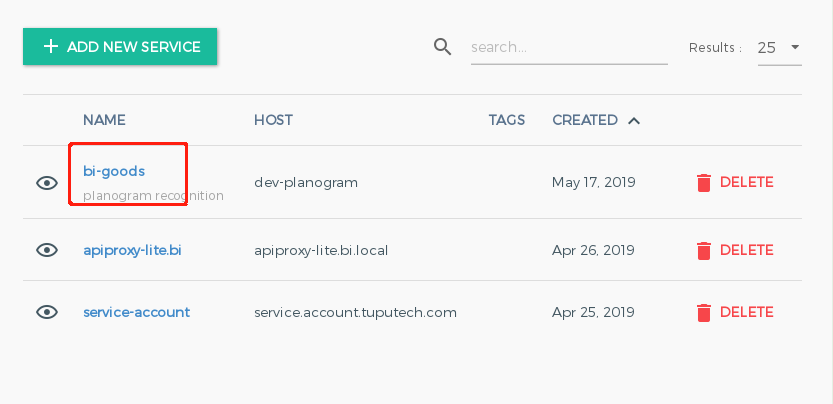

点击`Routes` 进入route配置页面， 一个服务可以有多个域名入口，如图：
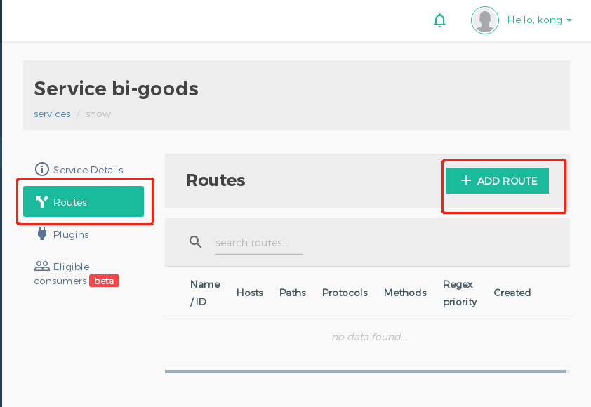

**添加路由**

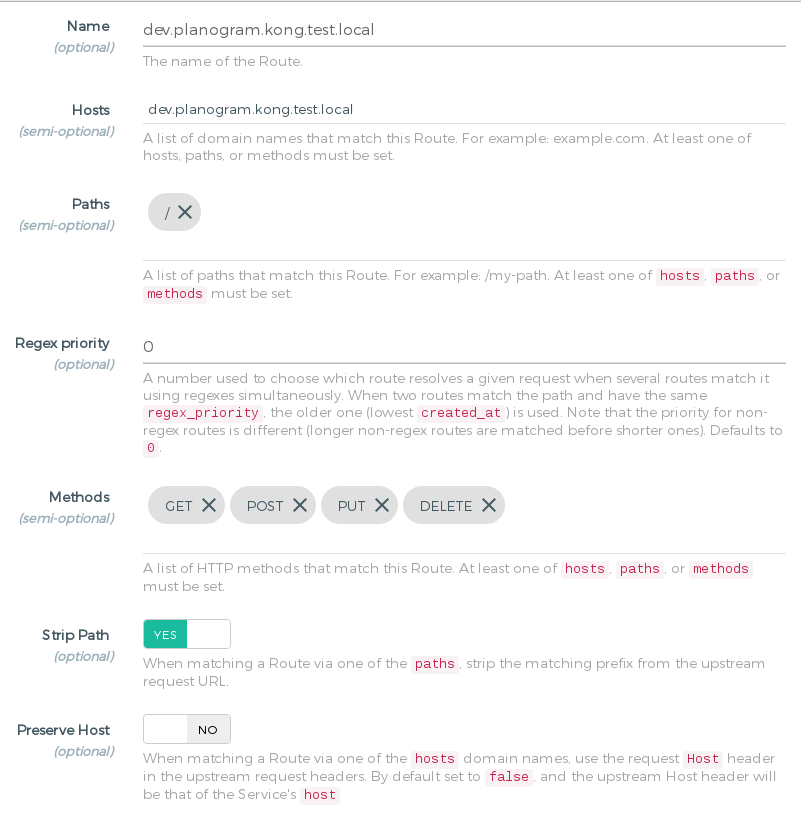

Name: dev.planogram.kong.test.local （路由名称）
Hosts: dev.planogram.kong.test.local (站点域名)
Paths：["/"] (服务对应域名路径， 由于是单体服务`/`, 所有路径转向相同的upstream， 域名包含多个upstream， 可以通过路径区分转到哪个， 输入后需要点击回车代表输入了)
Methods: ["GET", "POST", "PUT", "DELETE"]（方法，这个服务需要处理http Methods， 需要逐个输入，按回车）
Strip Path: false。 路径转换。如果输入例如 /api/auth, 如果为true， 把路径开头/api/auth这一个部分去掉，剩下后面路径。

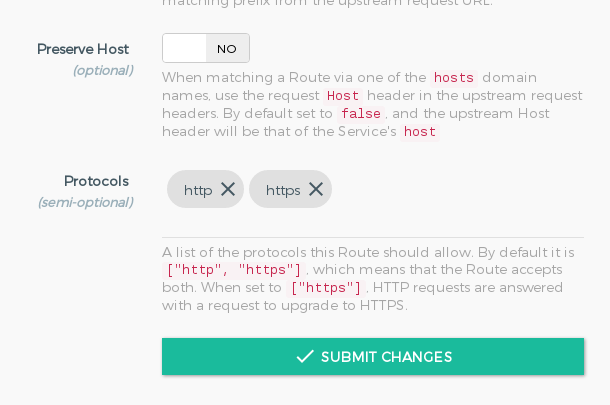

Protocols: ["http", "https"] (服务允许协议，由于测试所有保留http，正式生产不用了)


#### 测试

```
$ curl -H 'Host: dev.planogram.kong.test.local' http://172.26.2.3:8000/doc/index.html
```


