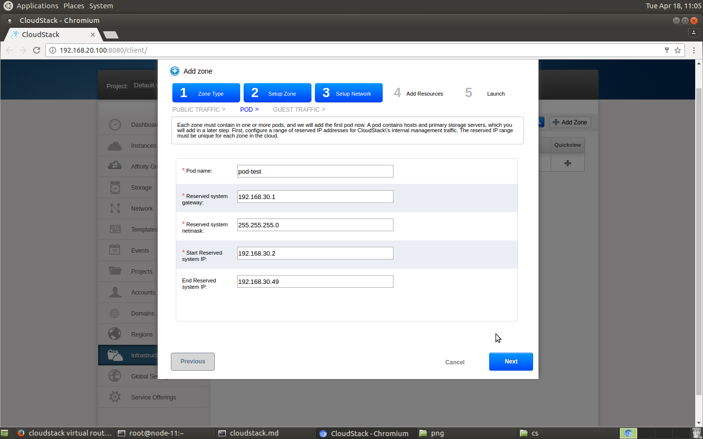
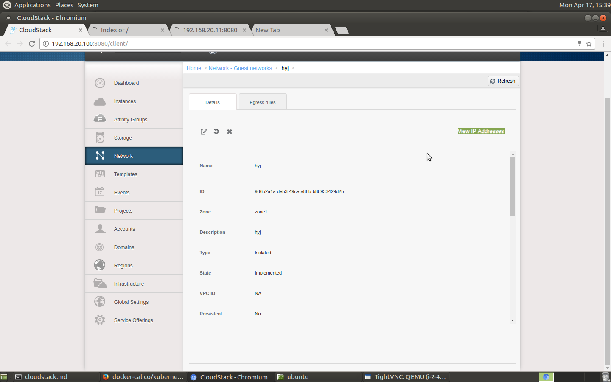

### 1.1 添加新的zone

### 1.1.1 选者高级网络模式如图

   
### 1.1.2 配置zone属性

   - IPv4DNS选者外网DNS, 内网如果有DNS填写内网DNS, 否者也填写外网DNS.
   - 然后选Hypervisor类型: 如kvm, xenserver 如图:
   

   点击Next就是网络配置

### 1.2 网络配置

### 1.2.1 添加pod public ip 地址段
    
- ip 地址段需要保留一些给cloudstack manager pod使用, 需要预留一段, 如图
   

### 1.2.2 POD 网络配置

- 配置pod的名字
- Reserved system gateway, Reserved system netmask与上一步骤一致
- 保留地址范围可以上一步ip地址段以外的范围. 如图

   

### 1.3 集群配置

### 1.3.1 集群属性设置

    输入集群名称就可以了

### 1.3.2 添加host机器 

- 填写host机器用户名和密码
- host机器cloudstack-agent 需要预先安装, 不需要启动
- `/etc/cloudstack/agent/agent.properties`由cloudstack-mgr配置
- 如果agent机器加入过集群需要清理  

### 1.4 怎么清理agent旧数据

### 1.4.1 清理virt里面无效pool
```
// 列举所有的pool
agent-node$ virsh pool-list
agent-node$ virsh pool-destroy <pool-uuid>
``` 

### 1.4.2 清理virt里面无效secret

```
// 列举所有的secret
agent-node$ virsh secret-list
agent-node$ virsh secret-undefine <secret-uuid>
```

### 1.5 全局变量配置

### 1.5.1 managerment host 配置

  - 如果发现cloudstack-agent无法连接cloudstack management, 需要查看agent节点查看下面文件

```
agent-node$ vim /etc/cloudstack/agent/agent.properties
...
host=192.168.0.2
...
```

 - 如果host地址与你的cloudstack management不匹配, 可以通过修改全局变量. 进入Home-Global Settings-Select view:Global Settings

 - 搜索条件输入host, 修改如下图
   


### 1.5.2 二级存储配置网段配置

```
global setting -> search sesc -> setting secstorage.allowed 配置secondstorage.allowed 的网段
```

### 1.6 添加公网ip地址
   
   申请公网ip地址步骤`home->network->Select view (选者网络类型)->选择网络名称->`如图
   

   点击`View IP Addresses`, 如图
   

   然后点击`Accquire new IP` 如图
   

   申请以后, 在quickview选者`Enable static NAT`
   
   
   选者指定公网ip地址的对应的机器
   

   再打开public ip所有防火墙屏蔽
   
   点击public ip -> configuration 如图
   
   
   打开TCP,UDP,ICMP屏蔽, 选项如图
   

   步骤结束以后, 可以通过公网ip登录vm 
    

### 1.7 登录虚拟路由器

### 1.7.1 查找虚拟路由器的locallink, 以及host

   Home-InfrastructureVirtual-Routersr-48-VM
   

### 1.7.2 通过ssh登录VR

```
// 登录node-11机器
$ ssh root@node-11
// 登录VR
$ ssh -i /root/.ssh/id_rsa.cloud 169.254.0.54 -p 3922
``` 

### 1.8 添加虚拟机套餐

- 进入页面Home-Service Offerings-Compute Offerings

### Bug in [centos7 agent]: unsupported configuration: CPU tuning is not available on this host

### 1) 修改libvirt文件
```
$vim /etc/libvirt/qemu.conf

# 屏蔽下面选项
#cgroup_controllers=["cpu"]

### Bug in [centos7 agent]: unsupported configuration: CPU tuning is not available on this host

### 1) 修改libvirt文件
```
$vim /etc/libvirt/qemu.conf

# 屏蔽下面选项
#cgroup_controllers=["cpu"]

$ systemctl restart libvirtd
``` 

### 2) 修改serviceConfig.py
```
$vim /usr/lib64/python2.7/site-packages/cloudutils/serviceConfig.py

# 屏蔽下面代码
#cfo.addEntry("cgroup_controllers", "[\"cpu\"]")
```
