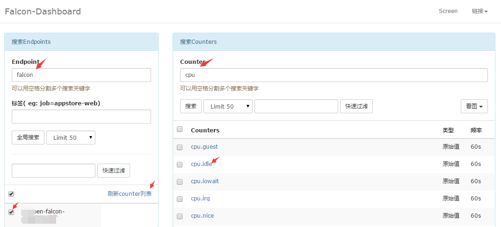

#1.查看监控数据

     我们说agent只要部署到机器上，并且配置好了heartbeat和transfer就自动采集数据了，我们就可以去dashboard上面搜索监控数据查看了。dashboard是个web项目，浏览器访问之。左侧输入endpoint搜索，endpoint是什么？应该用什么搜索？对于agent采集的数据，endpoint都是机器名，去目标机器上执行hostname，看到的输出就是endpoint，拿着hostname去搜索。

     进入`OpsPlatform` 主页面然后点击`监控趋势图`就可以查看机器指标了。

##1.1 列出某台机器所有指标

  `Enpoint`输入机器名字, 如果多台机器可以使用空格分开。然后点击`全局搜索`， 勾选主机， `刷新列表`，右边就可以显示主机监控指标，如果下图：
  

###1.1.1 选择指标
